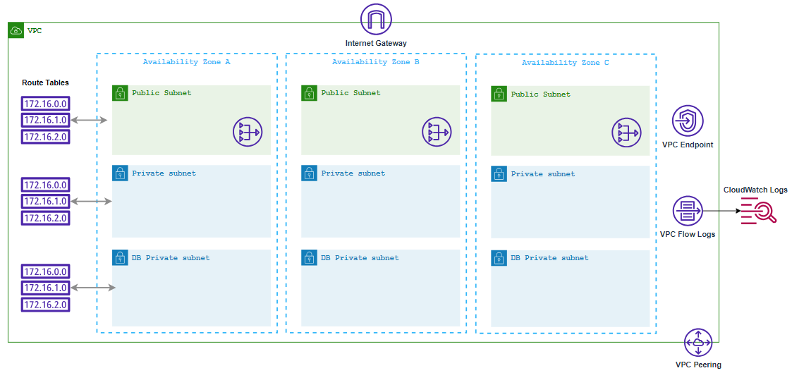

# DevOptymize AWS VPC Configuration Guide

### Overview

This is a [Jenkins pipeline script](./Jenkinsfile) that helps us to create aws vpc configuration such as VPC, Public Subnets, Private Subnets, Database subnet, NAT gateways, Internet gateways, Vpc endpoint, vpc flow logs, and vpc peering in an AWS account.

### RESOURCES CREATED

- VPC
- Subnets - Public, Private & Database (No of Subnets is determined by the no of cidrs provided by the user)
- Route tables  - Public, Private & Database
- Internet gateway
- NAT Gateway (one per every az)
- VPC endpoint
- VPC flow logs
- VPC Peering connection
### The Jenkins pipeline includes the following steps:

  - First, it takes user input in the form of credentials to provision the resources on an AWS account. The pipeline uses the ChoiceParameter to provide a list of credentials to choose from. The GroovyScript block defines the logic to fetch the credentials available in the Jenkins instance and returns a list of credentials associated with the user's login.

  - The pipeline then create a vpc configuration. It extracts the environment name from the input parameter and uses it to generate the names of the resources. The withCredentials block reads the access key and secret key from the AWS credentials associated with the account and uses them to run the CFT and TF commands that create the vpc configuration.

  - The agent any directive specifies that the pipeline can run on any agent machine with a specific label or without a label. In this case, it is not restricted to any agent machine.

  - The environment block defines two environment variables that are derived from the user input. PROJECT_NAME is extracted from the credential name, and ACCOUNT_ID is extracted by splitting the credential name at the underscore (_) character.

The pipeline has three stages:

  - The first stage cleans the workspace by removing any existing files from it. If the environment name parameter is empty, the pipeline stops and displays an error message. Otherwise, it sets the display name for the current build to include the project name, AWS account ID, and environment name.
  - The second stage used for SCM Checkout which instructs jenkins to obtain pipeline from SCM 
  - The third stage create the VPC-config-guide-architecture with Public Subnets, Private Subnets, Database subnet, NAT gateways, Internet gateways, Vpc endpoint, vpc flow logs, and vpc peering in the defined region.  For CFT, The process will wait, it outputs a message indicating that the stack creation is still in progress and waits for 30 seconds before checking the status again, after the stack creation complete. it will commit the output file in ops_devoptimize repo. It uses the if and else block to set the environment variables required for CloudFormationTemplate and Terraform. It then runs the CFT and TF  commands to create the VPC-config-guide-architecture.

Overall, this script provides a way to automate the creation of resources required for Terraform state management,CloudFormation and resource locking in an AWS account.

### Parameters:
Once you have the jenkins set up is done create a Job with the resource specified jenkins file. Then select the **Build with Parameters** in which the following parameters have to be specified.

| Parameters     |                                     Description                                                | Default Values  |
| :------------ |                                      :-----                                                     | :-------- |
| `ACTION`       |This parameter allows the user to select either Create or modify or delete a resources in the AWS account. This parameter will have list of actions such as Create, Modify and Delete.                    | `Create`   |
| `IAC_TOOL`     | This parameter allows the user to select one of the two IAC_TOOLS for creating the resource. The IAC-TOOLS which can be used are Cloudformation or Terraform  | `Terraform`  |
| `CREDENTIAL`       |This parameter allows the user to select the credential which has necessary permission to create a resource in the AWS account.                     | `project_xxxxxxxxxx_aws_cred`   |
| `ENVIRONMENT`       |  The parameter allows the user to enter the Environment in which the required resource can be created. for example: dev and prod environment.                    | `  |
| `REGION`       | This parameter allows the user to select the region in which the RDS Instances can be created. This parameter will have a list of all the regions upon which the user can select the desired region.                 | `us-east-1`   |
| `STACK_NAME`       |  This parameter allows the user to enter the desired name of the stack in the dialog box.        |  |
| `VPC_CIDR_RANGE`       | This parameter that defines the IP address range for an Amazon Virtual Private Cloud (VPC). It determines the available IP addresses for the resources within the VPC.                 |   |
| `PUBLIC_SUBNETS`       | This parameter that defines the list of public subnets within an Amazon Virtual Private Cloud (Amazon VPC). These subnets have their associated route tables configured to allow outbound internet access, making them suitable for hosting resources that require public accessibility, such as web servers or load balancers.      |   |
| `PRIVATE_SUBNETS`       | This parameter that refers to a subset of subnets within an Amazon VPC that are isolated from the public internet and primarily used for hosting private resources or services, ensuring additional security and control.              |   |
| `DATABASE_PRIVATE_SUBNETS`  |  This parameter that refers to a subset of subnets within an Amazon VPC that are isolated from the database internet and primarily used for hosting database resources or services, ensuring additional security and control. |   | 
| `SERVICE_NAME`   |   This parameter allows the user to select the service name of the VPC endpoint     |    |
| `PEER_REGION` |   This parameter allows the user to select the region for peering needs to be provisioned.              |     |
| `PEER_OWNER_ID`  |   This parameter allows the user to write the owner id.    |     |
| `VPC_PEER_ID` |  This parameter allows the user to mention the vpc id for peering needs to be launched.   |    |
| `VPC_PEER_CIDR_RANGE`  |  This parameter allows the user to mention the CIDR Range which needs to be attached to VPC peering.   |    |

### Features:
- Creating AWS VPC-config-guide-architecture using IaC (Terraform/CloudFormation) templates with parameterized jenkins build.
- Can be used to Create and Delete vpc configuration incase of Cloudformation and can Create, Modify and Delete VPC-config-guide-architecture incase of Terraform.
- Can be used to define environment in which resource can be created.

### Contributing
We welcome contributions from the community to enhance the Jenkins pipeline. If you would like to contribute, please follow our guidelines outlined in the [CONTRIBUTING.md](./CONTRIBUTING.md) file. You can submit feature requests, or pull requests to help us improve the template.

### License
