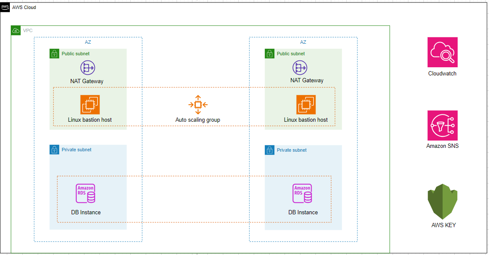

# DevOptymize AWS RDS STACK

### Overview

This is a [Jenkins pipeline script](./Jenkinsfile) that helps us to create aws rds stack such as VPC, Public Subnets, Private Subnets, NAT gateways, Internet gateways, Linux bastion host, RDS instances with multi az replicas, Cloudwatch, Amazon SNS and Amazon KMS in an AWS account.

### RESOURCES CREATED

- VPC
- Subnets - Public & Private (No of Subnets is determined by the no of cidrs provided by the user)
- Route tables  - Public, Private & Database
- Internet gateway
- NAT Gateway (one per every az)
- Linux bastion host (one per every az)
- RDS Instances with replicas (one per every az)
- Cloudwatch
- Amazon SNS
- Amazon KMS

### The Jenkins pipeline sets up the following

- A highly available architecture that spans two Availability Zones.
- A virtual private cloud (VPC) configured with public and private subnets, according to AWS best practices, to provide you with your own virtual network on AWS.

In the public subnets:

- Managed NAT gateways to allow outbound internet access for resources in the private subnets.
- An Linux bastion host in an Auto Scaling group to allow inbound SSH (Secure Shell) access to Amazon Elastic Compute Cloud (Amazon EC2) instances in public and private subnets.

In the private subnets:

- An Amazon RDS instances that includes a write replica in one Availability Zone and a read replica in the other.
- CloudWatch metrics for monitoring the database instance and CloudWatch logs for storing database logs.
- An Amazon Simple Notification Service (Amazon SNS) topic for sending CloudWatch alarm and Amazon RDS event notifications.
- AWS Key Management Service (AWS KMS) for encrypting the data stored in the database instance.

### The Jenkins pipeline includes the following steps

- First, it takes user input in the form of credentials to provision the resources on an AWS account. The pipeline uses the ChoiceParameter to provide a list of credentials to choose from. The GroovyScript block defines the logic to fetch the credentials available in the Jenkins instance and returns a list of credentials associated with the user's login.

- The pipeline then create an aws rds stack. It extracts the environment name from the input parameter and uses it to generate the names of the resources. The withCredentials block reads the access key and secret key from the AWS credentials associated with the account and uses them to run the CFT and TF commands that create the rds stack.

- The agent any directive specifies that the pipeline can run on any agent machine with a specific label or without a label. In this case, it is not restricted to any agent machine.

- The environment block defines two environment variables that are derived from the user input. PROJECT_NAME is extracted from the credential name, and ACCOUNT_ID is extracted by splitting the credential name at the underscore (_) character.

The pipeline has three stages:

- The first stage cleans the workspace by removing any existing files from it. If the environment name parameter is empty, the pipeline stops and displays an error message. Otherwise, it sets the display name for the current build to include the project name, AWS account ID, and environment name.
- The second stage used for SCM Checkout which instructs jenkins to obtain pipeline from SCM
- The third stage create the AWS-RDS-stack-architecture with Public Subnets, Private Subnets, Linux bastion host, RDS instances with multi az replicas, Cloudwatch, Amazon SNS and Amazon KMS in the defined region.  For CFT, The process will wait, it outputs a message indicating that the stack creation is still in progress and waits for 30 seconds before checking the status again, after the stack creation complete. it will commit the output file in ops_devoptimize repo. It uses the if and else block to set the environment variables required for CloudFormationTemplate and Terraform. It then runs the CFT and TF  commands to create the RDS-stack-architecture.

Overall, this script provides a way to automate the creation of resources required for Terraform state management,CloudFormation and resource locking in an AWS account.

### Parameters

Once you have the jenkins set up is done create a Job with the resource specified jenkins file. Then select the **Build with Parameters** in which the following parameters have to be specified.

| Parameters     |                                     Description                                                | Default Values TF  |         Default Values CFT |
| :------------ |                                      :-----                                                     | :-------- |           :------------ |
| `ACTION`       |This parameter allows the user to select either Create or modify or delete a resources in the AWS account. This parameter will have list of actions such as Create, Modify and Delete.                    | `Create`   |   `Create` |
| `IAC_TOOL`     | This parameter allows the user to select one of the two IAC_TOOLS for creating the resource. The IAC-TOOLS which can be used are Cloudformation or Terraform  | `Terraform`  |      `CloudFormation`  |
| `CREDENTIAL`       |This parameter allows the user to select the credential which has necessary permission to create a resource in the AWS account.                     | `ops_xxxxxxxxxx_aws_cred`   |    `ops_xxxxxxxxxx_aws_cred`  |
| `ENVIRONMENT`       |  The parameter allows the user to enter the Environment in which the required resource can be created. for example: dev and prod environment.                    | `  |
| `REGION`       | This parameter allows the user to select the region in which the RDS Instances can be created. This parameter will have a list of all the regions upon which the user can select the desired region.                 | `us-east-1`   |    `us-east-1` |
| `STACK_NAME`       |  This parameter allows the user to enter the desired name of the stack in the dialog box.        |  |
| `VPC_CIDR_RANGE`       | This parameter that defines the IP address range for an Amazon Virtual Private Cloud (VPC). It determines the available IP addresses for the resources within the VPC.                 |   |
| `PUBLIC_SUBNETS`       | This parameter that defines the list of public subnets within an Amazon Virtual Private Cloud (Amazon VPC). These subnets have their associated route tables configured to allow outbound internet access, making them suitable for hosting resources that require public accessibility, such as web servers or load balancers.      |   |
| `PRIVATE_SUBNETS`       | This parameter that refers to a subset of subnets within an Amazon VPC that are isolated from the public internet and primarily used for hosting private resources or services, ensuring additional security and control.              |   |
| `AMI_ID`     |   This parameter likely specifies a specific AMI that you want to use as the base for your EC2 instance.  
| `INSTANCE_TYPE` | This parameter specifies the type of Amazon EC2 instance that you want to launch.                                        | `r6a.2xlarge` |     `r6a.2xlarge`  |
| `KEY_PAIR`  |  This parameter is used for specifying the key pair that will be associated with the EC2 instance. It consists of a public key and a private key. When you launch an EC2 instance, you can use a key pair to securely access the instance via SSH (Secure Shell) or other remote access methods              | `odoo` |    `odoo` |
| `VOLUME_SIZE` | This parameter specifies the size of a storage volume, usually associated with an Amazon EC2 instance. Example 10 , 20 ,30
| ` VOLUME_TYPE ` | This parameter indicates the type of storage volume that will be created or attached to an EC2 instance. Example gp2, gp3
| ` ASG_DESIRED_CAPACITY ` | This parameter refers to the desired number of instances that you want to maintain within an Auto Scaling Group
| ` ASG_MIN_SIZE ` | This parameter sets the minimum number of instances that the Auto Scaling Group is allowed to have.
| ` ASG_MAX_SIZE ` | This parameter defines the maximum number of instances that the Auto Scaling Group can scale up to.
| `RDS_IDENTIFIER` | The parameter allows the user to enter the identifier for the RDS primary instance to be created.
|`ENGINE_TYPE` | The database engine type for the RDS instance, e.g., postgres, mysql, etc. |    |
| `ENGINE_VERSION` | This parameter allows the user to select the version of the selected database engine, e.g., 13.4 |   |
|`DB_INSTANCE_CLASS` | This parameter allows the user to select the instance class for the RDS instances within the cluster, e.g., db.t2.micro |   |
| `DB_MASTER_USERNAME` | This parameter allows the user to enter the master username for the RDS instance.
| `DB_MASTER_PASSWORD` | This parameter allows the user to enter The master password for the RDS instance.
| `LOG_EXPORTS` | This parameter allows the user to determine that you need to export logs to cloudwatch. | `yes` |   `yes` |
| `EMAIL_ADDRESS` | This parameter allows the user to determine that you need to enter the mail id for the SNS Notificatins.

### Features

- Creating AWS RDS-stack-architecture using IaC (Terraform/CloudFormation) templates with parameterized jenkins build.
- Can be used to Create and Delete RDS-stack incase of Cloudformation and can Create, Modify and Delete RDS-stack-architecture incase of Terraform.
- Can be used to define environment in which resource can be created.

#### Limitations

- The create and delete actions were functioning correctly in the Terraform script, except for the modify action.
- The modify action should work as intended in the Terraform script, similar to how create and delete actions are functioning correctly.

### Contributing

We welcome contributions from the community to enhance the Jenkins pipeline. If you would like to contribute, please follow our guidelines outlined in the [CONTRIBUTING.md](./CONTRIBUTING.md) file. You can submit feature requests, or pull requests to help us improve the template.

### License
