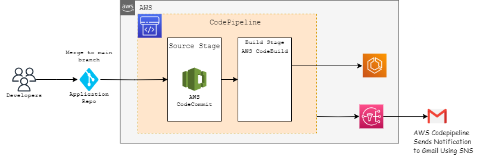

# AWS DevOps pipeline architecture - CI/CD of Backend application

### Overview 

- This is a Jenkins pipeline script that create AWS codepipeline for  static website with stages like source stage , build stage ,  and SNS topic for email notification .





### RESOURCES CREATED
- AWS CodePipeline: A fully automated pipeline with source and build stages.
  
  -  Source Stage: Retrieves source code from a repository and triggers the pipeline. It prepares source code for    further processing.
  
  -  Build Stage: Transforms source code into deployable artifacts. It compiles, tests, and packages code for deployment.
  
  
- S3 Bucket for Artifacts: A designated Amazon S3 bucket to store artifacts generated by CodePipeline.
- AWS SNS for Notifications: Setup for sending notifications through AWS SNS.

- IAM Roles and policies created are:
  - PipelineServiceRole: This IAM role is used for the CodePipeline service. It has the following policies attached:
    - AWSCodePipelineFullAccess
    - AWSCodeCommitFullAccess
    - AWSCodeBuildStartBuild
    - AWSSNSPublishAccess
    - AWSCodeStarNotifications

  - CodeBuildServiceRole: This IAM role is used for the CodeBuild service. It has the following policies attached:
    - AWSCodeBuildFullAccess

  - SNSTopicPolicy: This is an SNS topic policy that allows CodeStar Notifications service to publish to the SNS topic.

  - MyCodeStarNotificationRule: This is a CodeStar Notifications rule that specifies events and targets for notifications. It's associated with the SNS topic.


### PREREQUISITE 
- Amazon ECR  : Amazon ECR as a prerequisite in your CI/CD deployment for a backend application provides a reliable, secure, and efficient way to store and manage Docker container images. It ensures consistency in deployment, simplifies versioning, and integrates well with other AWS services for a streamlined development and deployment process.


### The Jenkins pipeline includes the following steps:

- First, it takes user input in the form of credentials to provision the resources on an AWS account. The pipeline uses the ChoiceParameter to provide a list of credentials to choose from. The GroovyScript block defines the logic to fetch the credentials available in the Jenkins instance and returns a list of credentials associated with the user's login.

- The pipeline then create AWS codepipeline for  static website . It extracts the environment name from the input parameter and uses it to generate the names of the resources. The withCredentials block reads the access key and secret key from the AWS credentials associated with the account and uses them to run the CFT and TF commands that create the vpc configuration.

-  The agent any directive specifies that the pipeline can run on any agent machine with a specific label or without a label. In this case, it is not restricted to any agent machine.

- The environment block defines two environment variables that are derived from the user input. PROJECT_NAME is extracted from the credential name, and ACCOUNT_ID is extracted by splitting the credential name at the underscore (_) character.

The pipeline has three stages:

  - The first stage cleans the workspace by removing any existing files from it. If the environment name parameter is empty, the pipeline stops and displays an error message. Otherwise, it sets the display name for the current build to include the project name, AWS account ID, and environment name.
  - The second stage used for SCM Checkout which instructs jenkins to obtain pipeline from SCM 
  - The third stage create the aws cicd sw architecture For CFT, The process will wait, it outputs a message indicating that the stack creation is still in progress and waits for 30 seconds before checking the status again, after the stack creation complete. it will commit the output file in ops_devoptimize repo. It uses the if and else block to set the environment variables required for CloudFormationTemplate and Terraform. It then runs the CFT and TF commands to create the aws cicd sw .

Overall, this script provides a way to automate the creation of resources required for Terraform state management,CloudFormation and resource locking in an AWS account.


### Parameters:
Once you have the jenkins set up is done create a Job with the resource specified jenkins file. Then select the **Build with Parameters** in which the following parameters have to be specified.

| Parameters     |                                     Description                                                | Default Values  |
| :------------ |                                      :-----                                                     | :-------- |
| `ACTION`       |This parameter allows the user to select either Create or modify or delete a resources in the AWS account. This parameter will have list of actions such as Create, Modify and Delete.                    | `Create`   |
| `IAC_TOOL`     | This parameter allows the user to select one of the two IAC_TOOLS for creating the resource. The IAC-TOOLS which can be used are Cloudformation or Terraform  | `Terraform`  |
| `CREDENTIAL`       |This parameter allows the user to select the credential which has necessary permission to create a resource in the AWS account.                     | `project_xxxxxxxxxx_aws_cred`   |
| `ENVIRONMENT`       |  The parameter allows the user to enter the Environment in which the required resource can be created. for example: dev and prod environment.                    | `  |
| `REGION`       | This parameter allows the user to select the region in which the RDS Instances can be created. This parameter will have a list of all the regions upon which the user can select the desired region.                 |    |
| `STACK_NAME`       |  This parameter allows the user to enter the desired name of the stack in the dialog box.        |  |
| `REPOSITORY_NAME`   |   Name of the AWS CodeCommit repository where your application source code is stored.     |    |
| `BRANCH_NAME`  | Name of the branch in the CodeCommit repository that will be monitored for changes.Whenever changes are pushed to this branch, the pipeline will automatically start. | `main`    |
| `COMPUTE_TYPE` |  The type of compute environment to use. This determines the number of CPU cores and memory for the build environment.Choose the appropriate value based on the resource requirements of your build.   |    |
| `IMAGE`  | The Docker image tag that identifies the Docker image to use for this build project.This image defines the runtime environment for your build and may contain build tools and dependencies. |    |
| `OPERATING_SYSTEM`  | The operating system for the build environment in CodeBuild. Choose the appropriate operating system based on your application's requirements.|    |
| `TYPE` |  The type of build environment to use for related builds.Choose the appropriate value based on the nature of the project and its dependencies.   |    |
| `EMAILS`  |  Email addresses to receive notifications via SNS (Simple Notification Service).Provide a list of email addresses to keep relevant team members informed about build status and issues.. |    |


### To test the entire flow, follow the steps

- Add following files into Code commit repository 


  - Dockerfile 
    ``` # Use the official NGINX image as the base image
        FROM public.ecr.aws/lts/nginx:latest


        # Remove the default NGINX configuration
        #RUN rm /etc/nginx/conf.d/default.conf

        # Copy your custom NGINX configuration file
        #COPY nginx.conf /etc/nginx/conf.d/

        # Copy your website files to the NGINX document root
        #COPY ./website /usr/share/nginx/html

        # Expose the port that NGINX will listen on
        EXPOSE 80

        # Start NGINX when the container starts 
        CMD ["nginx", "-g", "daemon off;"] 
    ```
 
  - buildspec.yml: Build specification file used by AWS CodeBuild to define the build and deployment process. 

      buildspec.yml
      ```version: 0.2
         phases:
           pre_build:
             commands:
               - echo Logging in to Amazon ECR...
               - aws ecr get-login-password --region us-east-1 | docker login --username AWS --password-stdin 123456789.dkr.ecr.us-east-1.amazonaws.com
          build:
            commands:
              - echo Build started on `date`
              - echo Building the Docker image...
              - docker build -t examplename .
              - docker tag examplename:latest 123456789.dkr.ecr.us-east-1.amazonaws.com/examplename:latest
          post_build:
            commands:
              - echo Build completed on `date`
              - aws ecr get-login-password --region us-east-1 | docker login --username AWS --password-stdin 123456789.dkr.ecr.us-east-1.amazonaws.com
              - echo Pushing the Docker image to ECR...
              - docker push 123456789.dkr.ecr.us-east-1.amazonaws.com/examplename:latest

      ```
    - Pre_build: Logging into Amazon ECR, preparing for the build process by authenticating Docker to the ECR registry.
    - Build: Building a Docker image named "examplename" and tagging it for latest version, based on the current date.
    - Post_build: After the build, re-authenticating with ECR, then pushing the Docker image to the specified ECR repository in the US East region.


This exemplar project illustrates the fundamental procedures for leveraging AWS CodeBuild to construct and push an image into Amazon ECR (Elastic Container Registry). By tailoring the buildspec.yml file, you can adapt the build process to align precisely with the unique prerequisites of your project.

- Note: If the chosen Infrastructure as Code (IAC) tool is set to 'CloudFormation,' the stack will be deleted, but the Code pipeline artifact S3 bucket will be retained. To delete the S3 bucket as well, you can use the following command: `aws s3 rb s3://bucketname --force`.


### Contributing
We welcome contributions from the community to enhance the Jenkins pipeline. If you would like to contribute, please follow our guidelines outlined in the [CONTRIBUTING.md](./CONTRIBUTING.md) file. You can submit feature requests, or pull requests to help us improve the template.

### License
