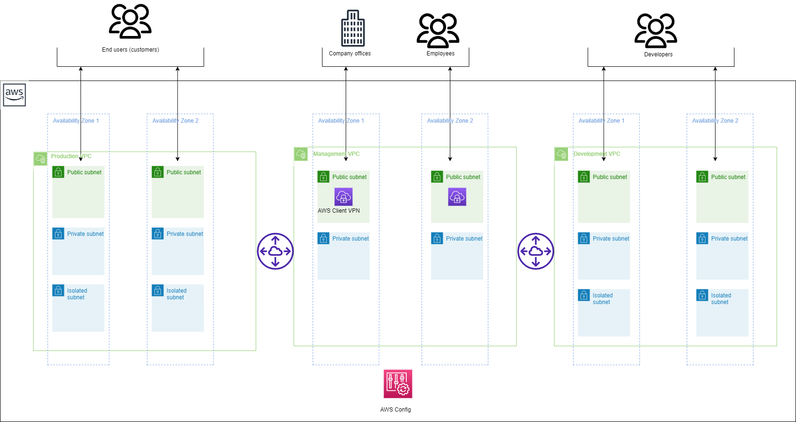

# The script to create the AWS fintech architecture 

### Overview

- This is a [Jenkins pipeline script](./Jenkinsfile) that create AWS fintech architecture . It includes resources such as network 3 VPC, VPC peering, natgateway , AWS client vpn , AWS config rules .

### RESOURCES CREATED

- 3 VPC (PRODUCTION, MANAGEMENT AND DEVELOPMENT)
- Subnets - Public, Private & Isolated (No of Subnets is determined by the no of cidrs provided by the user)
- Route tables  - Public & Private 
- Internet gateway
- VPC peering
- NAT Gateway (one per every az)
- AWS client VPN
- AWS Config rules
  - S3
  - IAM
  - NIST (Operational Best Practices for National Institute of Standards and Technology (NIST) Cybersecurity Framework)
  - PCI  (Operational Best Practices for Payment Card Industry Data Security Standard (PCI DSS) 3.2.1.)
  - CONTROL TOWER (AWS Control Tower Detective Guardrails.)

### The Jenkins pipeline includes the following steps:

- First, it takes user input in the form of credentials to provision the resources on an AWS account. The pipeline uses the ChoiceParameter to provide a list of credentials to choose from. The GroovyScript block defines the logic to fetch the credentials available in the Jenkins instance and returns a list of credentials associated with the user's login.

- The pipeline then create a vpc 3-tier-architecture to host wordpress appplication. It extracts the environment name from the input parameter and uses it to generate the names of the resources. The withCredentials block reads the access key and secret key from the AWS credentials associated with the account and uses them to run the CFT and TF commands that create the 3-tier-architecture.

- The agent any directive specifies that the pipeline can run on any agent machine with a specific label or without a label. In this case, it is not restricted to any agent machine.

- The environment block defines two environment variables that are derived from the user input. PROJECT_NAME is extracted from the credential name, and ACCOUNT_ID is extracted by splitting the credential name at the underscore (_) character.

- The pipeline has three stages:

  - The first stage cleans the workspace by removing any existing files from it. If the environment name parameter is empty, the pipeline stops and displays an error message. Otherwise, it sets the display name for the current build to include the project name, AWS account ID, and environment name.
  - The second stage used for SCM Checkout which instructs jenkins to obtain pipeline from SCM
  - The third stage create the AWS-fintech-architecture  with resources Networks, VPC peering, natgateway awsclient VPN in the defined region. For CFT, The process will wait, it outputs a message indicating that the stack creation is still in progress and waits for 30 seconds before checking the status again, after the stack creation complete. it will commit the output file in ops_devoptimize repo. It uses the if and else block to set the environment variables required for CloudFormationTemplate and Terraform. It then runs the CFT and TF commands to create the 3-tier-architecture to host wordpress.

Overall, this script provides a way to automate the creation of resources required for Terraform state management,CloudFormation and resource locking in an AWS account.

### AWSCONFIG RULES

- **AWS Control Tower Detective Guardrails Conformance** : The AWS Control Tower detective guardrails conformance pack contains all of the AWS Config Rules based guardrails from AWS Control Tower.
  - CheckForEbsOptimizedInstance
  - CheckForEc2VolumesInUse
  - CheckForEncryptedVolumes
  - CheckForIAMUserMFA
  - CheckForIAMUserConsoleMFA
  - CheckForRdsPublicAccess
  - CheckForPublicRdsSnapshots
  - CheckForRdsStorageEncryption
  - CheckForRestrictedCommonPortsPolicy
  - CheckForRestrictedSshPolicy
  - CheckForRestrictedSshPolicy
  - CheckForS3PublicRead
  - CheckForS3PublicWrite
  - CheckForS3VersioningEnabled
  
- **Operational Best Practices for AWS Identity and Access Management**
  - AccessKeysRotated
  - IAMGroupHasUsersCheck
  - IAMPasswordPolicy
  - IAMPolicyNoStatementsWithAdminAccess
  - IAMRootAccessKeyCheck
  - IAMUserGroupMembershipCheck
  - IAMUserMFAEnabled
  - IAMUserNoPoliciesCheck
  - IAMUserUnusedCredentialsCheck
  - MFAEnabledForIAMConsoleAccess
  - RootAccountHardwareMFAEnabled
  - RootAccountMFAEnabled

- **Operational Best Practices for NIST CSF**
  - AccessKeysRotated
  - AcmCertificateExpirationCheck
  - AlbHttpToHttpsRedirectionCheck
  - ApiGwCacheEnabledAndEncrypted
  - ApiGwExecutionLoggingEnabled
  - AutoscalingGroupElbHealthcheckRequired
  - CloudTrailCloudWatchLogsEnabled
  - CloudTrailEnabled
  - CloudTrailEncryptionEnabled
  - CloudTrailLogFileValidationEnabled
  - CloudtrailS3DataeventsEnabled
  - CloudwatchAlarmActionCheck
  - CloudwatchLogGroupEncrypted
  - CodebuildProjectEnvvarAwscredCheck
  - CodebuildProjectSourceRepoUrlCheck
  - DbInstanceBackupEnabled
  - DmsReplicationNotPublic
  - DynamodbAutoscalingEnabled
  - DynamodbPitrEnabled
  - DynamodbThroughputLimitCheck
  - EbsOptimizedInstance
  - EbsSnapshotPublicRestorableCheck
  - Ec2InstanceDetailedMonitoringEnabled
  - Ec2InstanceManagedBySsm
  - Ec2InstanceNoPublicIp
  - Ec2ManagedinstanceAssociationComplianceStatusCheck
  - Ec2ManagedinstancePatchComplianceStatusCheck
  - Ec2SecurityGroupAttachedToEni
  - Ec2StoppedInstance
  - Ec2VolumeInuseCheck
  - EfsEncryptedCheck
  - EipAttached
  - ElasticacheRedisClusterAutomaticBackupCheck
  - ElasticsearchEncryptedAtRest
  - ElasticsearchInVpcOnly
  - ElbAcmCertificateRequired
  - ElbDeletionProtectionEnabled
  - ElbLoggingEnabled
  - EmrKerberosEnabled
  - EmrMasterNoPublicIp
  - EncryptedVolumes
  - GuarddutyEnabledCentralized
  - GuarddutyNonArchivedFindings
  - IamGroupHasUsersCheck
  - IamPasswordPolicy
  - IamPolicyNoStatementsWithAdminAccess
  - IamRootAccessKeyCheck
  - IamUserGroupMembershipCheck
  - IamUserMfaEnabled
  - IamUserNoPoliciesCheck
  - IamUserUnusedCredentialsCheck
  - IncomingSshDisabled
  - InstancesInVpc
  - InternetGatewayAuthorizedVpcOnly
  - KmsCmkNotScheduledForDeletion
  - LambdaConcurrencyCheck
  - LambdaDlqCheck
  - LambdaFunctionPublicAccessProhibited
  - LambdaInsideVpc
  - MfaEnabledForIamConsoleAccess
  - MultiRegionCloudTrailEnabled
  - RdsEnhancedMonitoringEnabled
  - RdsInstancePublicAccessCheck
  - RdsMultiAzSupport
  - RdsSnapshotsPublicProhibited
  - RdsStorageEncrypted
  - RedshiftClusterConfigurationCheck
  - RedshiftClusterPublicAccessCheck
  - RedshiftRequireTlsSsl
  - RestrictedIncomingTraffic
  - RootAccountHardwareMfaEnabled
  - RootAccountMfaEnabled
  - S3AccountLevelPublicAccessBlocks
  - S3BucketDefaultLockEnabled
  - S3BucketLoggingEnabled
  - S3BucketPolicyGranteeCheck
  - S3BucketPublicReadProhibited
  - S3BucketPublicWriteProhibited
  - S3BucketReplicationEnabled
  - S3BucketServerSideEncryptionEnabled
  - S3BucketSslRequestsOnly
  - S3BucketVersioningEnabled
  - SagemakerEndpointConfigurationKmsKeyConfigured
  - SagemakerNotebookInstanceKmsKeyConfigured
  - SagemakerNotebookNoDirectInternetAccess
  - SecretsmanagerRotationEnabledCheck
  - SecretsmanagerScheduledRotationSuccessCheck
  - SecurityhubEnabled
  - SnsEncryptedKms
  - VpcDefaultSecurityGroupClosed
  - VpcFlowLogsEnabled
  - VpcSgOpenOnlyToAuthorizedPorts
  - VpcVpn2TunnelsUp
- **Operational Best Practices for PCI DSS 3.2.1**
  - AccessKeysRotated
  - AcmCertificateExpirationCheck
  - AlbHttpToHttpsRedirectionCheck
  - ApiGwCacheEnabledAndEncrypted
  - ApiGwExecutionLoggingEnabled
  - CloudTrailCloudWatchLogsEnabled
  - CloudTrailEnabled
  - CloudTrailEncryptionEnabled
  - CloudTrailLogFileValidationEnabled
  - CloudtrailS3DataeventsEnabled
  - CloudwatchLogGroupEncrypted
  - CmkBackingKeyRotationEnabled
  - CodebuildProjectEnvvarAwscredCheck
  - CodebuildProjectSourceRepoUrlCheck
  - DmsReplicationNotPublic
  - DynamodbTableEncryptionEnabled
  - EbsSnapshotPublicRestorableCheck
  - Ec2InstanceManagedBySsm
  - Ec2InstanceNoPublicIp
  - Ec2ManagedinstanceAssociationComplianceStatusCheck
  - Ec2ManagedinstancePatchComplianceStatusCheck
  - Ec2SecurityGroupAttachedToEni
  - EfsEncryptedCheck
  - EipAttached
  - ElasticsearchEncryptedAtRest
  - ElasticsearchInVpcOnly
  - ElbAcmCertificateRequired
  - ElbLoggingEnabled
  - EmrKerberosEnabled
  - EmrMasterNoPublicIp
  - EncryptedVolumes
  - GuarddutyEnabledCentralized
  - IamPasswordPolicy
  - IamPolicyNoStatementsWithAdminAccess
  - IamRootAccessKeyCheck
  - IamUserMfaEnabled
  - IamUserNoPoliciesCheck
  - IamUserUnusedCredentialsCheck
  - IncomingSshDisabled
  - InternetGatewayAuthorizedVpcOnly
  - LambdaFunctionPublicAccessProhibited
  - LambdaInsideVpc
  - MfaEnabledForIamConsoleAccess
  - RdsInstancePublicAccessCheck
  - RdsSnapshotsPublicProhibited
  - RdsStorageEncrypted
  - RedshiftClusterConfigurationCheck
  - RedshiftClusterPublicAccessCheck
  - RedshiftRequireTlsSsl
  - RestrictedIncomingTraffic
  - RootAccountHardwareMfaEnabled
  - RootAccountMfaEnabled
  - S3AccountLevelPublicAccessBlocks
  - S3BucketLoggingEnabled
  - S3BucketPolicyGranteeCheck
  - S3BucketPublicReadProhibited
  - S3BucketPublicWriteProhibited
  - S3BucketServerSideEncryptionEnabled
  - S3BucketSslRequestsOnly
  - S3BucketVersioningEnabled
  - SagemakerEndpointConfigurationKmsKeyConfigured
  - SagemakerNotebookInstanceKmsKeyConfigured
  - SagemakerNotebookNoDirectInternetAccess
  - SecretsmanagerRotationEnabledCheck
  - VpcFlowLogsEnabled
  - VpcSgOpenOnlyToAuthorizedPorts

- **Operational Best Practices for Amazon S3**
  - S3BucketPublicReadProhibited
  - S3BucketPublicWriteProhibited
  - S3BucketReplicationEnabled
  - S3BucketSSLRequestsOnly
  - ServerSideReplicationEnabled
  - S3BucketLoggingEnabled
  

### Parameters:
Once you have the jenkins set up is done create a Job with the resource specified jenkins file. Then select the **Build with Parameters** in which the following parameters have to be specified.

| Parameters     |                       Description                                         | Default Values TF |        Default Values CFT |   
| :------------ |                        :-----                                              | :-------- |                :------------ |
| `ACTION`       |This parameter allows the user to select either Create or modify or delete a resources in the AWS account. This parameter will have list of actions such as Create, Modify and Delete.                    | `Create`   |            `create` |
| `IAC_TOOL`     | This parameter allows the user to select one of the two IAC_TOOLS for creating the resource. The IAC-TOOLS which can be used are Cloudformation or Terraform  | `Terraform`  |      `CloudFormation`  |
| `CREDENTIAL`       |This parameter allows the user to select the credential which has necessary permission to create a resource in the AWS account.                     | `ops_xxxxxxxxxx_aws_cred`   |    `ops_xxxxxxxxxx_aws_cred`  |
| `ENVIRONMENT`       |  The parameter allows the user to enter the Environment in which the required resource can be created. for example: dev and prod environment.                    |   |
| `REGION`       | This parameter allows the user to select the region in which the RDS Instances can be created. This parameter will have a list of all the regions upon which the user can select the desired region.                 | `us-east-1`   |    `us-east-1` |
| `STACK_NAME`       |  This parameter allows the user to enter the desired name of the stack in the dialog box.        |  |
| `VPC_PRODUCTION_CIDR`       | Specify the range of IP addresses for your VPC in CIDR notation. For example, if you want to allocate IP addresses from 10.0.0.0 to 10.0.255.255, you would use "10.0.0.0/16" as the CIDR range.                |   |
| `VPC_MANAGEMENT_CIDR`       | Specify the range of IP addresses for your VPC in CIDR notation. For example, if you want to allocate IP addresses from 192.168.0.0 to 192.168.255.255, you would use "192.168.0.0/16" as the CIDR range.      |   |
| `VPC_DEVELOPMENT_CIDR`       | Specify the range of IP addresses for your VPC in CIDR notation. For example, if you want to allocate IP addresses from 172.16.0.0 to 172.16.255.255, you would use "172.16.0.0/16" as the CIDR range.  |   |
| `PRODUCTION_PUBLIC_CIDR`  |  Customize the CIDR ranges for your public subnets using a list format. To define multiple private subnets, provide a comma-separated list of CIDR ranges enclosed in square brackets. For instance: ["10.0.0.0/24", "10.0.1.0/24", "10.0.2.0/24"]. |   | 
| `PRODUCTION_PRIVATE_CIDR`     | Customize the CIDR ranges for your private subnets using a list format. To define multiple private subnets, provide a comma-separated list of CIDR ranges enclosed in square brackets. For instance: ["10.0.0.0/24", "10.0.1.0/24", "10.0.2.0/24"].
| `PRODUCTION_ISOLATED_CIDR` | Customize the CIDR ranges for your isolated subnets using a list format. To define multiple private subnets, provide a comma-separated list of CIDR ranges enclosed in square brackets. For instance: ["10.0.0.0/24", "10.0.1.0/24", "10.0.2.0/24"].  | |  |
| `MANAGEMENT_PUBLIC_CIDR`  |  Tailor the CIDR ranges for  subnets using a list format. To define multiple subnets, provide a comma-separated list of CIDR ranges enclosed in square brackets. For example: ["192.168.1.0/24", "192.168.3.0/24"]. || |
| `MANAGEMENT_PRIVATE_CIDR` |Tailor the CIDR ranges for  subnets using a list format. To define multiple subnets, provide a comma-separated list of CIDR ranges enclosed in square brackets. For example: ["192.168.1.0/24", "192.168.3.0/24"].
| `DEVELOPMENT_PUBLIC_CIDR  ` | Tailor the CIDR ranges for  subnets using a list format. To define multiple subnets, provide a comma-separated list of CIDR ranges enclosed in square brackets. For example:["172.16.1.0/24", "172.16.3.0/24"].
| `DEVELOPMENT_PRIVATE_CIDR` | Tailor the CIDR ranges for  subnets using a list format. To define multiple subnets, provide a comma-separated list of CIDR ranges enclosed in square brackets. For example:["172.16.1.0/24", "172.16.3.0/24"].
| `DEVELOPMENT_ISOLATED_CIDR` | Tailor the CIDR ranges for  subnets using a list format. To define multiple subnets, provide a comma-separated list of CIDR ranges enclosed in square brackets. For example:["172.16.1.0/24", "172.16.3.0/24"]. |  |  |
| `CLIENTCIDRBLOCK` | AWS Client CIDR Range is a user-defined IP address range that you configure when setting up a Client VPN (Virtual Private Network) in AWS. This range defines the pool of IP addresses that will be assigned to remote clients when they connect to the VPN                                
| ` SERVER_CERTIFICATE` |SSL/TLS server certificate that is used to secure communications between clients (e.g., web browsers) and a web server.
| `CLIENT_CERTIFICATE` |  SSL/TLS mutual authentication, clients can provide certificates to servers to prove their identity. 
| `AWS_CONFIGRULES` | The aws_configrules variable allows you to specify a list of AWS Config rules or configurations within your infrastructure code.

### Contributing
We welcome contributions from the community to enhance the Jenkins pipeline. If you would like to contribute, please follow our guidelines outlined in the [CONTRIBUTING.md](./CONTRIBUTING.md) file. You can submit feature requests, or pull requests to help us improve the template.

### License
