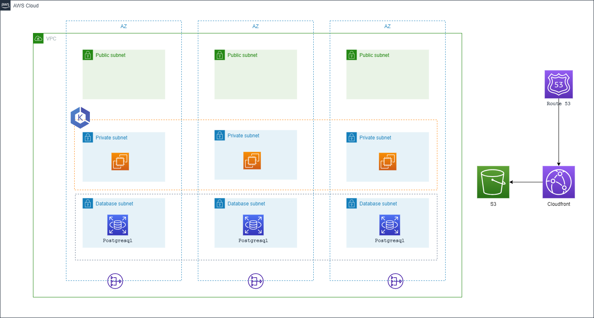

# Microservices architecture with Network, EKS cluster, RDS cluster, S3, CloudFront and Route53

### PREREQUISITE

- The User must have the valid ACM certificate in their AWS account.

### RESOURCES CREATED

- VPC Resources
  - VPC with specified CIDR range and availability zones.
  - Private and public subnets within the VPC.
  - NAT gateways for private subnets.
  - Security groups for the EKS cluster and RDS.

- EKS Cluster Resources
  - Amazon EKS cluster with managed node group.
  - IAM roles and policies associated with EKS and node group.
  - Security groups for the EKS cluster and its nodes.

- RDS Cluster Resources
  - Amazon RDS postgres cluster.
  - Security group for RDS cluster.

- Amazon S3 Bucket
  - Amazon S3 bucket for code hosting with versioning enabled.
  - S3 bucket policy allowing access from CloudFront.

- Amazon CloudFront Distribution
  - CloudFront distribution for content delivery.
  - Origin configurations pointing to the S3 bucket.

- Amazon Route 53
  - DNS records associated with the CloudFront distribution.

- Additional IAM and Policy Resources:
  - IAM role for EKS managed node group.
  - IAM role for CloudFront distribution.

### Overview

- This is a Jenkins pipeline script that create Microservice architecture such as network, EKS cluster, RDS cluster, S3, CloudFront and Route53 in an AWS account.

- The pipeline includes the following steps:

- First, it takes user input in the form of credentials to provision the resources on an AWS account. The pipeline uses the ChoiceParameter to provide a list of credentials to choose from. The GroovyScript block defines the logic to fetch the credentials available in the Jenkins instance and returns a list of credentials associated with the user's login.

- The pipeline then creates a Microservice architecture. It extracts the environment name from the input parameter and uses it to generate the names of the resources. The withCredentials block reads the access key and secret key from the AWS credentials associated with the account and uses them to run the CFT and TF commands that create the Microservice architecture.

- The agent any directive specifies that the pipeline can run on any agent machine with a specific label or without a label. In this case, it is not restricted to any agent machine.

- The environment block defines two environment variables that are derived from the user input. PROJECT_NAME is extracted from the credential name, and ACCOUNT_ID is extracted by splitting the credential name at the underscore (_) character.

- The pipeline has three stages:

  - The first stage cleans the workspace by removing any existing files from it. If the environment name parameter is empty, the pipeline stops and displays an error message. Otherwise, it sets the display name for the current build to include the project name, AWS account ID, and environment name.
  - The second stage used for SCM Checkout which instructs jenkins to obtain pipeline from SCM
  - The third stage create the Microservice architecture with resources Network, EKS cluster, RDS cluster, S3, CloudFront and Route53 in the defined region. For CFT, The process will wait, it outputs a message indicating that the stack creation is still in progress and waits for 30 seconds before checking the status again, after the stack creation complete. it will commit the output file in ops_devoptimize repo. It uses the if and else block to set the environment variables required for CloudFormationTemplate and Terraform. It then runs the CFT and TF commands to create the Microservice architecture.

Overall, this script provides a way to automate the creation of resources required for Terraform state management,CloudFormation and resource locking in an AWS account.

### Parameters

Once you have the jenkins set up is done create a Job with the resource specified jenkins file. Then select the **Build with Parameters** in which the following parameters have to be specified.

| Parameters     |                                     Description                                                | Default Values  |
| :------------ |                                      :-----                                                     | :-------- |
| `ACTION`       |This parameter allows the user to select either Create or modify or delete a resources in the AWS account. This parameter will have list of actions such as Create, Modify and Delete.                    | `Create`   |
| `IAC_TOOL`     | This parameter allows the user to select one of the two IAC_TOOLS for creating the resource. The IAC-TOOLS which can be used are Cloudformation or Terraform  | `Terraform`  |
| `CREDENTIAL`       |This parameter allows the user to select the credential which has necessary permission to create a resource in the AWS account.                     | `project_xxxxxxxxxx_aws_cred`   |
| `ENVIRONMENT`       |  The parameter allows the user to enter the Environment in which the required resource can be created. for example: dev and prod environment.                    | `  |
| `REGION`       | This parameter allows the user to select the region in which the RDS Instances can be created. This parameter will have a list of all the regions upon which the user can select the desired region.                 | `us-east-1`   |
| `STACK_NAME`       |  This parameter allows the user to enter the desired name of the stack in the dialog box.        |  |
| `VPC_CIDR_RANGE`       | This parameter that defines the IP address range for an Amazon Virtual Private Cloud (VPC). It determines the available IP addresses for the resources within the VPC.                 |   |
| `PUBLIC_SUBNETS`       | This parameter that defines the list of public subnets within an Amazon Virtual Private Cloud (Amazon VPC). These subnets have their associated route tables configured to allow outbound internet access, making them suitable for hosting resources that require public accessibility.      |   |
| `PRIVATE_SUBNETS`       | This parameter that refers to a subset of subnets within an Amazon VPC that are isolated from the public internet and primarily used for hosting private resources or services, ensuring additional security and control.              |   |
| `DATABASE_PRIVATE_SUBNETS`  |  This parameter that refers to a subset of subnets within an Amazon VPC that are isolated from the database internet and primarily used for hosting database resources or services, ensuring additional security and control. |   |
| `ENGINE_TYPE`  |   This parameter states that only we can able to create the postgres type of engine for the DB cluster    |  `postgres`   |
| `ENGINE_VERSION` |  This parameter allows the user to select the engine version of postgres and the Multi-AZ DB cluster deployment option is available for PostgreSQL version 13.4 R1 and above, Choose engine version above 13.4   | `11.6`   |
| `DB_MASTER_USERNAME`  |  This parameter allows the user to enter their DB's username  |    |
| `DB_MASTER_PASSWORD`  |  This parameter allows the user to enter the DB's password    |    |
| `DB_INSTANCE_CLASS`   |  This parameter allows the user to select the instance class for their DB |  `db.m6g.16xlarge`  |
| `RDS_STORAGE`         |  This parameter allows the user to enter the storage of their DB instance |                     |
| `CLUSTER_VERSION`      |  This parameter allows the user to select the version of their EKS cluster |   `1.26`   |
| `EKS_NODE_GROUP_INSTANCE_TYPE`  | This parameter will used to give the instance type for the EKS cluster and the user should give list of string format when they choose IAC as terraform, For example: ["m5.large"]. If the user chooses the IAC as CloudFormation then it should be in string format, For example: "m5.large"  |    |
| `EKS_NODE_GROUP_MIN_SIZE`  | This parameter allows the user to give the min size of the EKS nodes.  If you choose the IAC as CloudFormation then this parameter will be hided and take the size of the node group as 3 automatically.  |   |
| `EKS_NODE_GROUP_MAX_SIZE`  | This parameter allows the user to give the maximum size of the EKS nodes but the maximum value we can give is 3. If you choose the IAC as CloudFormation then this parameter will be hided and take the size of the node group as 3 automatically.  |   |
| `EKS_NODE_GROUP_DESIRED_SIZE` | This parameter will allows the user to give the desired size of the EKS nodes and only the value upto 3 is allowed here. If you choose the IAC as CloudFormation then this parameter will be hided and take the size of the node group as 3 automatically. |     |
| `EKS_NODE_GROUP_CAPACITY_TYPE`  | This parameter will allows the user to select the capacity type of the nodes  |   `ON_DEMAND`   |
| `CDN_ALIASES`     | This parameter will allows the user to CDN aliases name for the CloudFront distributions. Example: ["test.ex001.in"], this should be given in list of string format.  |    |
| `ACM_CERTIFICATE_ARN`   | This parameter allows the user to pass the ARN of their ACM certificate which they have in their desired region where they are going to create the infrastructure.      |           |
| `HOSTED_ZONE_ID`   | This parameter allows the user to give the existing hosted zone ID for the Route53    |   |
| `RECORD_NAME`   |   This parameter allows the user to mention the route53 record name which is going to be created  |   |

### LIMITATION -  

When you choose the `Modify` action type and proceed to change the username and password for an Amazon RDS (Relational Database Service) instance, the RDS instance is  deleted and recreated as a standard course of action.

### Contributing

We welcome contributions from the community to enhance the Jenkins pipeline. If you would like to contribute, please follow our guidelines outlined in the [CONTRIBUTING.md](./CONTRIBUTING.md) file. You can submit feature requests, or pull requests to help us improve the template.

### License
