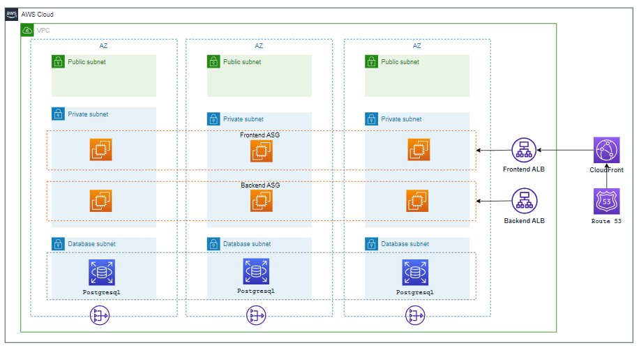

# The script to create the 3 tier arhitecture

### Overview

- This is a [Jenkins pipeline script](./Jenkinsfile) that create 3-tier architecture such as network, Launch template, Auto-scaling group, Application load balancer, RDS database, CloudFront, Route53 in an AWS account.

### RESOURCES CREATED

- VPC
- Subnets - Public, Private & Database (No of Subnets is determined by the no of cidrs provided by the user)
- Route tables  - Public, Private & Database
- Internet gateway
- NAT Gateway (one per every az)
- Launch templates
- Auto-scaling groups (both frontend and backend in the private subnets)
- Application load balancer (Internet facing for frontend and internal for backend services)
- RDS Cluster (PostgreSQl)
- CloudFront (Load balancer as its backend)
- Route53 record (for the cloudront)

### The Jenkins pipeline includes the following steps

- First, it takes user input in the form of credentials to provision the resources on an AWS account. The pipeline uses the ChoiceParameter to provide a list of credentials to choose from. The GroovyScript block defines the logic to fetch the credentials available in the Jenkins instance and returns a list of credentials associated with the user's login.

- The pipeline then create a vpc 3-tier-architecture. It extracts the environment name from the input parameter and uses it to generate the names of the resources. The withCredentials block reads the access key and secret key from the AWS credentials associated with the account and uses them to run the CFT and TF commands that create the 3-tier-architecture.

- The agent any directive specifies that the pipeline can run on any agent machine with a specific label or without a label. In this case, it is not restricted to any agent machine.

- The environment block defines two environment variables that are derived from the user input. PROJECT_NAME is extracted from the credential name, and ACCOUNT_ID is extracted by splitting the credential name at the underscore (_) character.

- The pipeline has three stages:

  - The first stage cleans the workspace by removing any existing files from it. If the environment name parameter is empty, the pipeline stops and displays an error message. Otherwise, it sets the display name for the current build to include the project name, AWS account ID, and environment name.
  - The second stage used for SCM Checkout which instructs jenkins to obtain pipeline from SCM
  - The third stage create the 3-tier-architecture with resources Networks, Launch template, Auto-scaling group, Application load balancer, RDS Database, CloudFront, Route53 in the defined region. For CFT, The process will wait, it outputs a message indicating that the stack creation is still in progress and waits for 30 seconds before checking the status again, after the stack creation complete. it will commit the output file in ops_devoptimize repo. It uses the if and else block to set the environment variables required for CloudFormationTemplate and Terraform. It then runs the CFT and TF commands to create the 3-tier-architecture.

Overall, this script provides a way to automate the creation of resources required for Terraform state management,CloudFormation and resource locking in an AWS account.

### Parameters

Once you have the jenkins set up is done create a Job with the resource specified jenkins file. Then select the **Build with Parameters** in which the following parameters have to be specified.

| Parameters     |                       Description                                    | Default Values TF |        Default Values CFT |
| :------------ |                        :-----                                         | :-------- |                :------------ |
| `ACTION`       |This parameter allows the user to select either Create or modify or delete a resources in the AWS account. This parameter will have list of actions such as Create, Modify and Delete.                    | `Create`   |  `Create`  |
| `IAC_TOOL`     | This parameter allows the user to select one of the two IAC_TOOLS for creating the resource. The IAC-TOOLS which can be used are Cloudformation or Terraform  | `Terraform`  |     `CloudFormation`    |
| `CREDENTIAL`       |This parameter allows the user to select the credential which has necessary permission to create a resource in the AWS account.                     | `project_xxxxxxxxxx_aws_cred`   |     `project_xxxxxxxxxx_aws_cred`    |
| `ENVIRONMENT`       |  The parameter allows the user to enter the Environment in which the required resource can be created. for example: dev and prod environment.                    | `  |
| `REGION`       | This parameter allows the user to select the region in which the RDS Instances can be created. This parameter will have a list of all the regions upon which the user can select the desired region.                 | `us-east-1`   |     `us-east-1`  |
| `STACK_NAME`       |  This parameter allows the user to enter the desired name of the stack in the dialog box.        |  |
| `VPC_CIDR_RANGE`       | This parameter that defines the IP address range for an Amazon Virtual Private Cloud (VPC). It determines the available IP addresses for the resources within the VPC.                 |   |
| `PUBLIC_SUBNETS`       | This parameter that defines the list of public subnets within an Amazon Virtual Private Cloud (Amazon VPC). These subnets have their associated route tables configured to allow outbound internet access, making them suitable for hosting resources that require public accessibility, such as web servers or load balancers.      |   |
| `PRIVATE_SUBNETS`       | This parameter that refers to a subset of subnets within an Amazon VPC that are isolated from the public internet and primarily used for hosting private resources or services, ensuring additional security and control.              |   |
| `DATABASE_PRIVATE_SUBNETS`  |  This parameter that refers to a subset of subnets within an Amazon VPC that are isolated from the database internet and primarily used for hosting database resources or services, ensuring additional security and control. |   |
| `AMI_ID`     |   This parameter likely specifies a specific AMI that you want to use as the base for your EC2 instance.
| `INSTANCE_TYPE` | This parameter specifies the type of Amazon EC2 instance that you want to launch.                                        | `r6a.2xlarge` |     `r6a.2xlarge` |
| `KEY_PAIR`  |  This parameter is used for specifying the key pair that will be associated with the EC2 instance. It consists of a public key and a private key. When you launch an EC2 instance, you can use a key pair to securely access the instance via SSH (Secure Shell) or other remote access methods              | `odoo` |      `odoo` |
| `VOLUME_SIZE` | This parameter specifies the size of a storage volume, usually associated with an Amazon EC2 instance. Example 10 , 20 ,30
| ` VOLUME_TYPE ` | This parameter indicates the type of storage volume that will be created or attached to an EC2 instance. Example gp2, gp3
| ` INGRESSRULES ` | parameter likely refers to the set of rules that define inbound network traffic permissions for a security group associated with an AWS resource.
| ` OPERATINGSYSTEM ` | This parameter specifies the type of operating system . For terraform u dont need to choose anything. Only for the cft we need to choose between linux and windows.                                  | `Dont have to choose OS` |     `linux`    |
| ` ASG_DESIRED_CAPACITY ` | This parameter refers to the desired number of instances that you want to maintain within an Auto Scaling Group
| ` ASG_MIN_SIZE ` | This parameter sets the minimum number of instances that the Auto Scaling Group is allowed to have.
| ` ASG_MAX_SIZE ` | This parameter defines the maximum number of instances that the Auto Scaling Group can scale up to.
| ` ACM_CERTIFICATE_ARN_ALB ` | This parameter specifies the ACM certificate ARN used for the loadbalancer
| `RDS_CLUSTER_IDENTIFIER` |  This parameter specifies the unique identifier for an Amazon RDS cluster.
| ` ENGINE_TYPE `        |  This parameter refers to the type of database engine that the RDS cluster will use. In this case, the value aurora-mysql indicates that the RDS cluster will use Amazon Aurora, a fully managed MySQL-compatible relational database engine          | `aurora-mysql` |        `aurora-mysql` |
| ` ENGINE_VERSION ` |   This parameter specifies the specific version of the database engine to be used.              | `5.7.mysql-aurora.2.07.9` |     `5.7.mysql-aurora.2.07.9` |
| `DB_MASTER_USERNAME` | This parameter likely represents the username of the master user for the RDS cluster and it Can't contain any of the following: / (slash), '(single quote), "(double quote) and @ (at sign).
| `DB_MASTER_PASSWORD` | This parameter is the password associated with the master user for the RDS cluster and Can't contain any of the following: / (slash), '(single quote), "(double quote) and @ (at sign).
| ` DB_INSTANCE_CLASS ` |  This parameter defines the compute and memory resources allocated to individual database instances within the RDS cluster.                        | `db.m6g.16xlarge`|       `db.m6g.16xlarge`|
| ` HOSTED_ZONE_ID ` |This  parameter  refers to the unique identifier of a DNS (Domain Name System) hosted zone in Amazon Route 53
| ` DOMAIN_NAME ` | This parameter specifies the domain name that the hosted zone in Amazon Route 53 is associated with.
| `ACM_CERTIFICATE_ARN_CLOUDFRONT` | This parameter specifies the ACM certificate ARN used for CloudFront

### Contributing

We welcome contributions from the community to enhance the Jenkins pipeline. If you would like to contribute, please follow our guidelines outlined in the [CONTRIBUTING.md](./CONTRIBUTING.md) file. You can submit feature requests, or pull requests to help us improve the template.

### License
